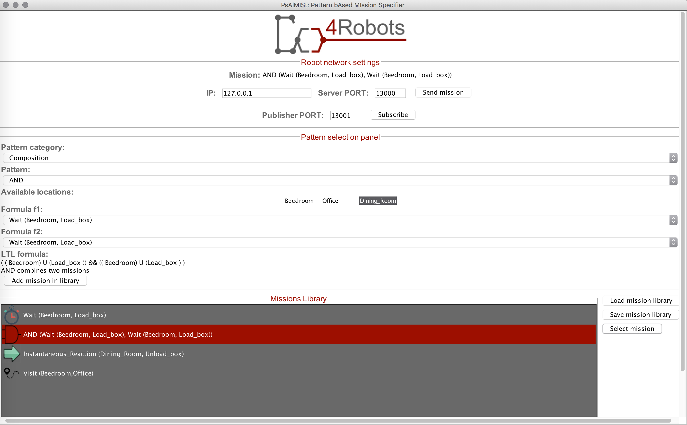

# PsAlMISt: Pattern bAsed MIssion Specifier

PsAlMISt is a Pattern bAsed MIssion Specifier implemented as a Java 1.8 application. It allows to create complex missions based on a set of Movement specification patterns. PsAlMISt can also send the created mission to a given planner that computes and executes it. It is fully integrated within the Co4robot project [http://www.co4robots.eu/](http://www.co4robots.eu/)

## An overview on PsAlMISt

## Pre-requisites

* At least Java version 1.8

