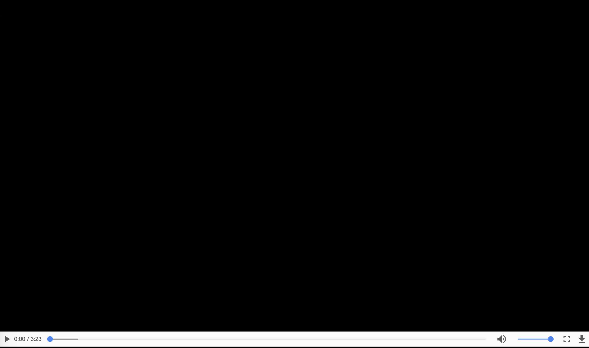

# PsAlMISt: Pattern bAsed MIssion Specifier

PsAlMISt is a Pattern bAsed MIssion Specifier implemented as a Java 1.8 application. It allows to create complex missions based on a set of Movement specification patterns. PsAlMISt can also send the created mission to a given planner that computes and executes it. It is fully integrated within the Co4robot project [http://www.co4robots.eu/](http://www.co4robots.eu/)

You can consult the full list of patterns and have additional information in [http://178.62.206.217/patterns/](http://178.62.206.217/patterns/)

## Publications
* Poster: Property Specification Patterns for Robotic Missions  
40th International Conference on Software Engineering (ICSE), Poster Track
Claudio Menghi, Christos Tsigkanos, Thorsten Berger, Patrizio Pelliccione, Carlo Ghezzi

## Video of PsAlMISt in action

## An overview on PsAlMISt
An overview on PsAlMISt is provided in the following figure

The PsAlMISt  GUI is organize in three different perspectives. 
* <b>Robot Network Settings</b>: it contains the address of a remote server able to forward the requests mission to the running robots.
The server is organized in the following way. A client-server architecture is used to send mission to the running robots.
A publish subscribe architecture is used to the remote application to notify the GUI of any change. For example, the publish subscribe architecture is used to notify the GUI when new locations and actions are detected 
* <b>Pattern Panel Selection </b> is used to specify the mission of interest by exploiting the proposed pattern catalog
* <b> Mission Library </b> organizes the specified mission into a library that can be used to load, store and compose the  missios of interest

## Using PsAlMISt
* Requirements: at least the Java version 1.8 must be installed on your laptop
* [Download](https://github.com/claudiomenghi/PsAlMISt/releases) the last version of PsAlMISt
* Double click on the downloaded jar
* If you want to use PsAlMISt with ROS, you can use for example a Rest2Ros component [https://github.com/claudiomenghi/Rest2Ros](https://github.com/claudiomenghi/Rest2Ros) that can be integrated with LTL planners such as [https://github.com/MengGuo/tiago_ltl_flexbe](https://github.com/MengGuo/tiago_ltl_flexbe)

## Example scenarios

### Coffe delivery
In this scenarios the robot has to bring the coffe to an employee. The mission is realizing by using the order visit pattern, that forces the robot to visit first the coffe room and then the office the employee and two instantaneous reaction patterns, one that asks a user to load the coffe on the robot when the kitchen is reached, the other that asks the employee to remove the coffe from the robot when the office is reached.

### Fika organizer 
Fika in sweden is a moment in which people  have coffee accompanied with pastries, cookies or pie. The robot has to call people for the fika break. The mission is realizing by using the  visit pattern (no ordering is required on how the employees are called), that forces the robot to visit two areas of a building. The instantaneous reaction patterns is used to specify that the robot should call employee for fika when each area is entered. 

### Fire robot
If a fire is detected the robot has to force the employee to leaving the building. The mission is realized using the patrolling pattern. The robot keeps patrolling the corridor  and the kitchen. Two instantaneous reaction patterns are used to force the robot sending alerting messages to the employees.

